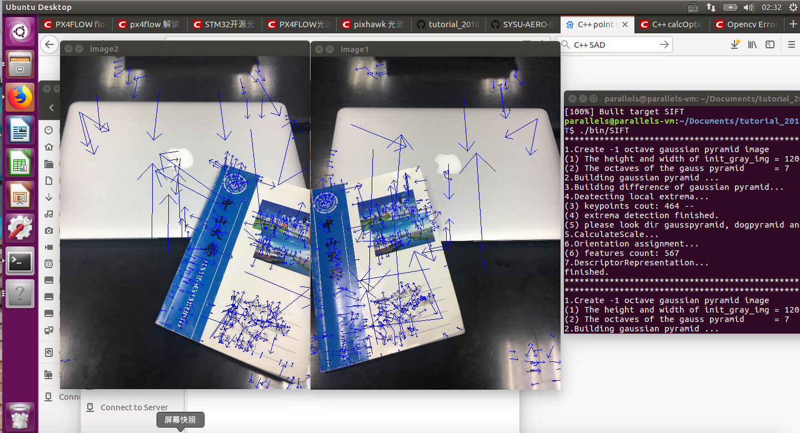
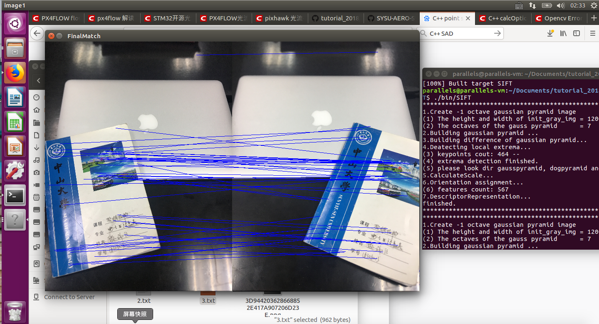

# SIFT --Scale-invariant feature transform
* Abstract : a project using SIFT algorithm to match feature points in two pictures
## Authors
* **P1ckCheN **
## Getting Started
* Scale Invariant Feature Transform is a scale invariant feature transformation,it's very stable which keeps invariance to rotation, scaling, brightness change, etc
* This project aims to build a SIFT algorithm without the function which opencv build in.
* Realize matching key points from the image input

### Prerequisites
softeware needed
```
ubuntu 16.04
Opencv 3.4.3
```
## Running the tests
enter the floder '1_SIFT',using cmd:
```
cmake .
make 
./bin/SIFT
```

the input images are int the floder
```
./data
```

### Samples output
output samples include to picture,one is detect the keypoint and the other is matching keypoint for the two similar images 
```
./output
```




