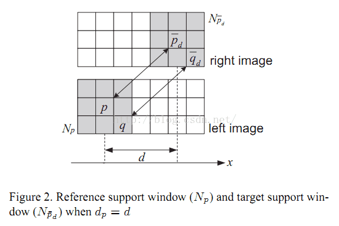
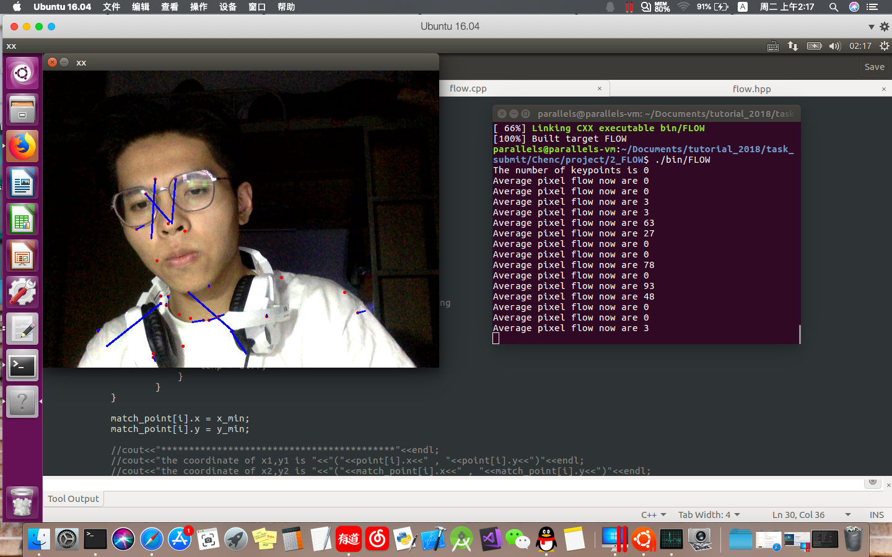

# FLOW CALCULATE
Abstract : a project based on SAD block matching algorithm to calculate the flow via camera

### Theory
- The SAD(Sum of absolute differences) is the sum of the absolute value of difference between two pictures

- we can use it on camera to calculate the flow of images per frame
- my project is refer to the PX4FLOW/flow.c,which used the SAD matching to calculate the average displacement of pixel.
### Prerequisites
softeware needed
```
ubuntu 16.04
Opencv 3.4.3
```
## Running the tests
```
cmake  .
make
./bin/FLOW
```
### Samples output
calculate the flow of the camera input  
```
./samples/capture.png
```  
  
### Demo
```
./samples/FLOW.gif
./output/FLOW.mov 
```  
  
## Authors 
* **P1ckCheN **


