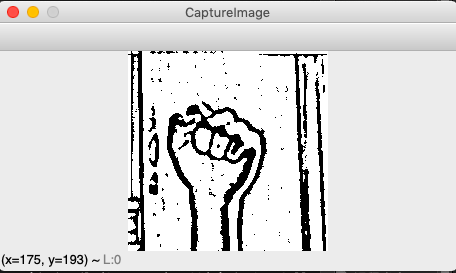
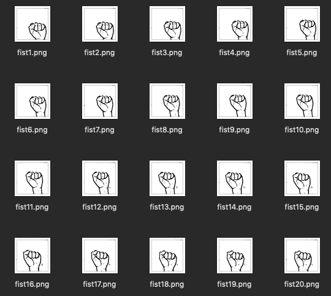
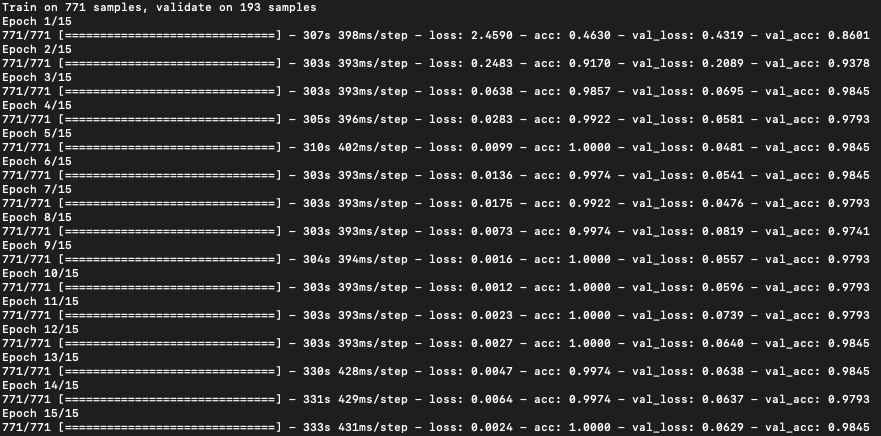
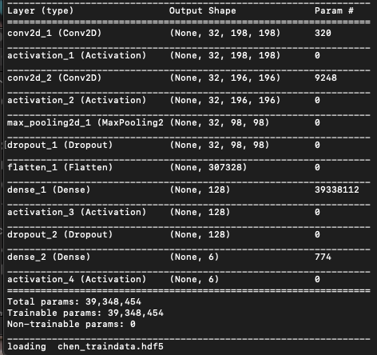
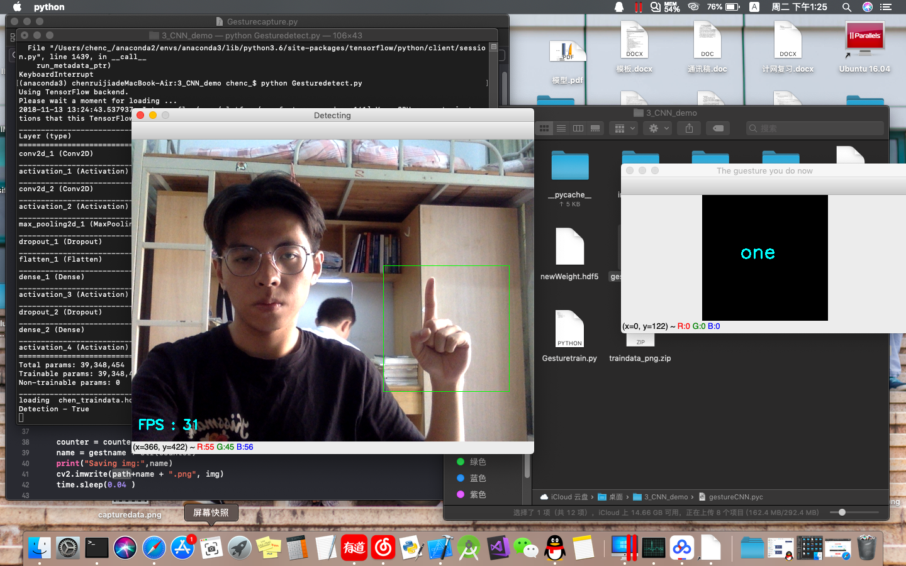

# CNN GESTURE RECOGNITION

Abstract : A gestrue recognition project via CNN.Implemented in Keras & Tensorflow & opencv

### Prerequisites

softeware needed

```
Python 3.6.1
Opencv 3.4.3
Keras 2.0.2
Tensorflow 1.2.1
Mac Os Mojave 10.14.1 (optional)
```

## Running the tests
### step1--capture your own traindata
```
python3 Gesturecapture.py
```
* press 'n' to enter the name of gesture
* press 's' to start  capture
### step2--train the data you get
```
python3 Gesturetrain.py
```
### step3--recognize the gesture
if you had trained your models,it would create a hdf5 file(from keras)
you can get my train data from :

* hdf5 file--链接:https://pan.baidu.com/s/1bZFQ5SF5U-3KvGbpyuI--A  密码:p9wa
* image file--链接:https://pan.baidu.com/s/1UFnj8j7Jhr6BALfdKwRgSg  密码:bw7j

you can run the cnn gesture detect successfully with the traindata  
press 'x' to start detection
## Samples output
- The output for capture my own traindata  

saving  

- The train process,I set the epoch 15  


- The final gesture recognize output  

detecting  

## Reference With
* [CNNGestureRecognizer](https://github.com/asingh33/CNNGestureRecognizer) - The reference resources used
## Authors
* **P1ckCheN **

