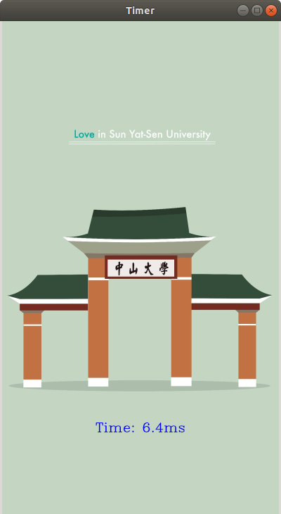

## Interactive Timer
- Author: HausinLynn
- Revised: HausinLynn
- Date: 10/03/2018
- Version: 1.0.0.1
- Abstract: Hello, this is a interactive
timer, which has output both in terminal
and window.

---

### Project struct

```
timer_exercise
|- inc/  (header file)
|- src/  (source file)
|- main/ (main source file)
|- obj/  (object file)
|- bin/  (test program)
|- README.md
|- Makefile
```

---

### Usage

```
# compile
make -j16

# run
cd bin
./test
```

---

### Expected OUTPUT

```
# terminal
[INFO] Welcome to the counter.
[NOTE] Command:
                start   -----   start counting
				stop    -----   stop counting
				pause   -----   pause counting
				resume  -----   resume counting
				quit    -----   quit program
start
[INFO] Start counting.
1
2
3
4
5
6
pause
[INFO] Paused.
resume
[INFO] Resumed.
7
8
9
10
11
stop
[INFO] Stop counting.
quit
[INFO] Program existed.
```

window:


