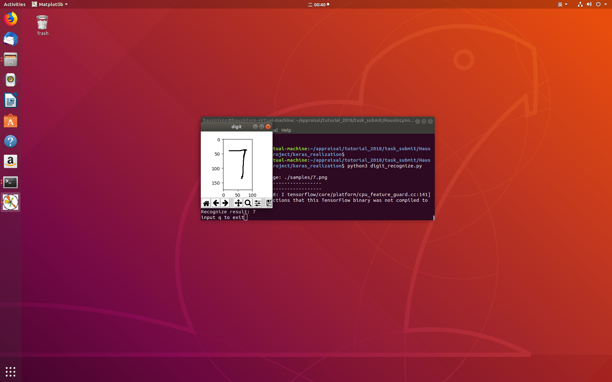

# MNIST Project
- Author: HausinLynn
- Revised: HausinLynn
- Data: 10/27/2018
- Version: 1.0.0.1
- Abstract: Hello, this is a project about
MNIST, I realize it with keras and SVM
respectively.

---

### Dependencies
- python 3.6.6
- keras 2.2.4
- libsvm 3.23
- numpy
- PIL
- matplotlib


---

### Usage

For keras realization:

```
cd keras_realization

# train
python3 mnist_train.py

# test
python3 mnist_test.py

# recognize
python3 digit_recognize.py
input the path of the image: [image path]
PS: you can test the image in keras_realization/samples

```

For libsvm realization:

```
cd libsvm_realization

# train
python3 mnist_classify.py

```

---

### OUTPUT

Train with keras:


Train with libsvm:


```
We can see, when train with libsvm, cost 813.31s, but accuracy is 94%. When train with keras, cost 82.79s, but accuracy is 99.17%.
It's obviously that using keras to build neural networks is more efficient than using libsvm to classfy.
```

Recognize output:

0:


1:


2:


3:


4:


5:


6:


7:


8:


9:

