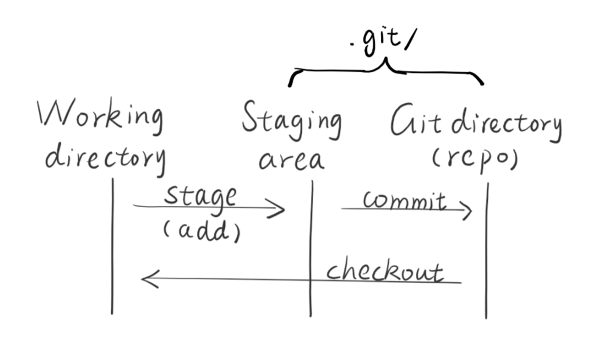
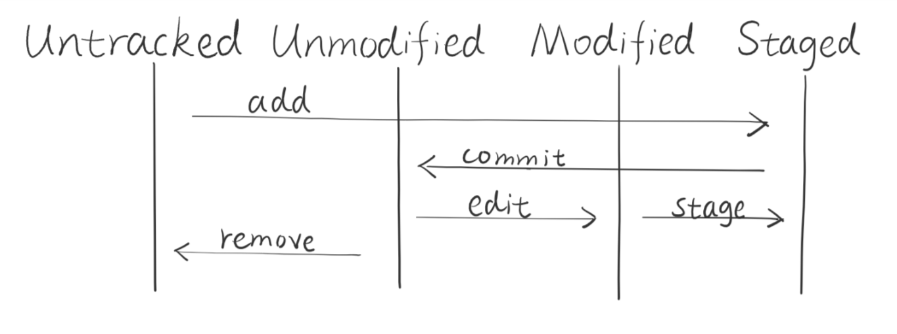
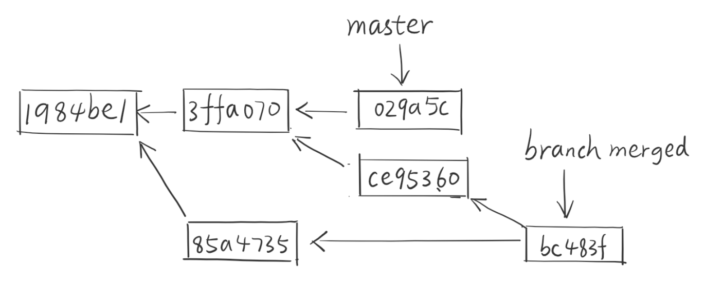

# Git workflow

* Author: atlanswer
* Date: 2018-09-29

I didn't actually know about Git until a year ago when I tried to get my hands on a "project" that involved several people. In fact, I heared of some relative words like "VCS", "GitHub" or something, then I realized that I need a proper "version control" system to make life better. Frankly speaking, Git is a really good software, though complicated, and working with others on GitHub is an enjoyable process.

1. Basic Git Workflow

 Git repository works like this:
 

..* Working directory

Woring directory contains the "current" files that we are working on, which have four statuses:
 

Git will automatically track all the files in the working directory apart from those who were listed in a special file named .gitignore. After a logical change was completed, we can commit a change. During our working process, all the files being tracked go through the status cycle above.

Git takes a snapshot of all files changed at each commit and stores them completely with a SHA-1 check code as the commit ID rather that just saves what's changed.

2. Git branch

Git branch is a pointer pointing to a specific commit, and every commit contains a pointer pointing to the last commit. With branches, we can diverge from main line and do other things without messing with main line. The default branch name is *master*.

If we checkout to another branch and commit, the pointer will lead this branch away. After we finished the modification, we can merge this branch back to the original branch we came from. Git encourages constantly do branch and merge to focus on one job which keep the working directory clean.

3. How to merge

First, we have to make sure the branch's work is done, e.g. source files are compiled successfully and work fine, documents were well prepared. Then we can checkout to the original branch and try to merge the new branch.

* If the original branch hasn't changed since we switched to the new branch. Git will merge the new branch using fast-forward method, which just simply move the pointer forward.

* If the original branch did changed, Git will try to do a three-way merge based on two branches common ancestor, which was chosen by Git automatically.

* If auto merge failed, Git will paused and wait for a fix. We can use default mergetool or solve it using whatever we want. After all conflicts were solved, we can run `git add` on each file to mark it as resolved.