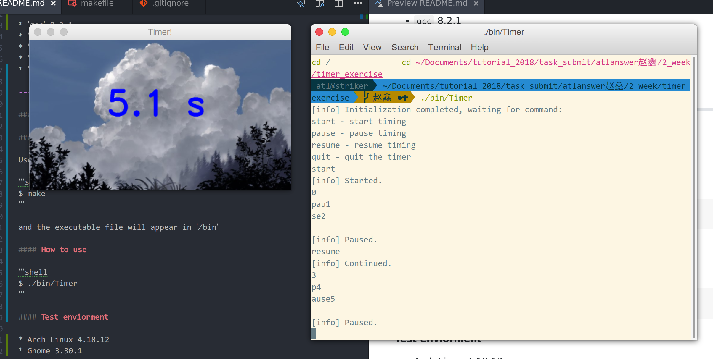

## Timer exercise

* Author: Atlanwer (atlanswer@gmail.com)
* Revised: Atlanswer
* Date: 2018-10-05
* Version: Beta-2
* Abstract: Project files for timer exercise.

---

### Dependencies

* `gcc` 8.2.1
* `opencv` 3.4.3-3
* `hdf5` 1.10.3-2
* `vtk` 8.1.1-2
* `glew` 2.1.0-1

---

### Usage

#### How to build

Use GNU `make`

```shell
$ make
```

and the executable file will appear in `/bin`

#### How to use

```shell
$ ./bin/Timer
```

#### Screenshot



#### Test enviorment

* Arch Linux 4.18.12
* Gnome 3.30.1

**NOTE:** If you encounter unexpected behaviors or errors, please try to close the program and restart it for several times. The program was tested and functional.

#### Directory tree

.</br>
├── bin</br>
├── inc</br>
│   └── Timer.hpp</br>
├── makefile</br>
├── README.md</br>
├── res</br>
│   ├── background.jpg</br>
│   └── Screenshot.png</br>
├── src</br>
│   ├── Global.cpp</br>
│   ├── Main.cpp</br>
│   └── Timer.cpp</br>
└── test</br>