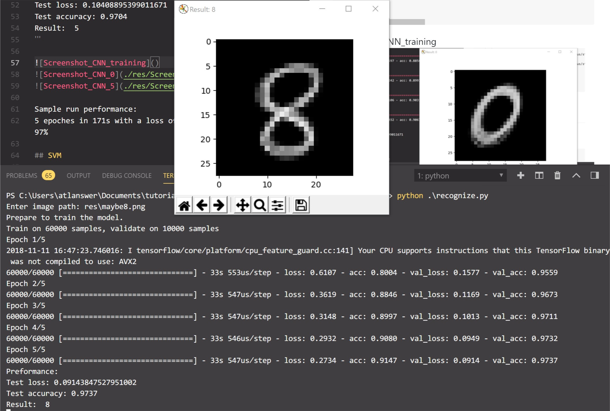
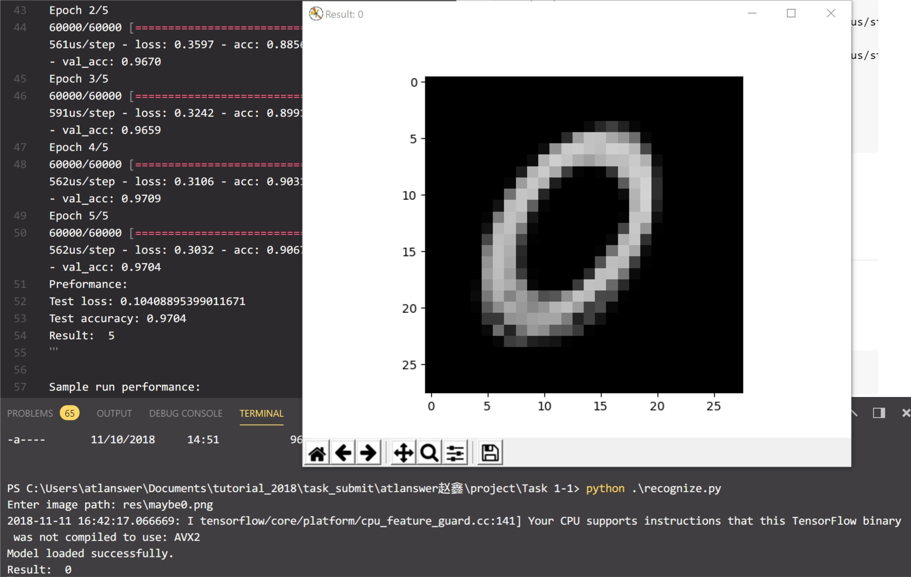
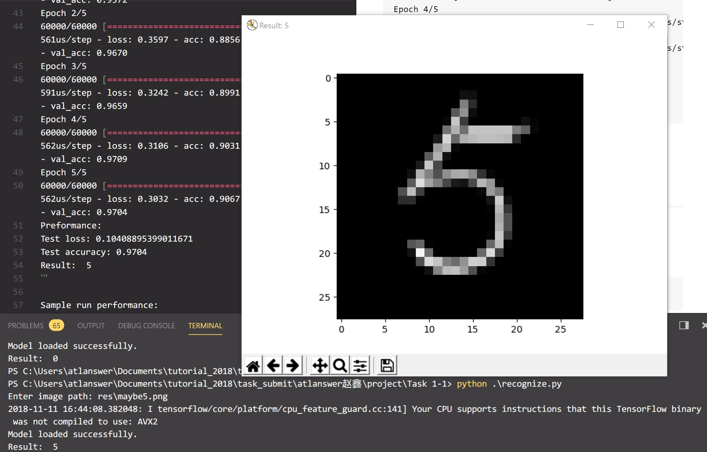
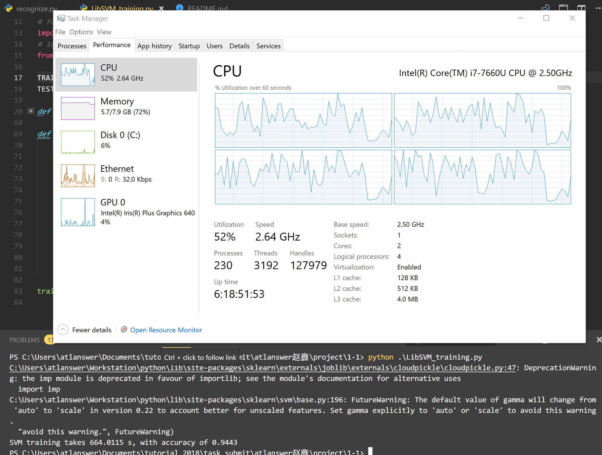

# Task 1-1 Image classcification

* Author: atlanswer
* Revised: atlanswer
* Date: 2018/11/10
* Version: debug
* Abstract: Handwritten digit classcification using keras and LibSVM based on MNIST database

---

## Dependencies

* `python` 3.6.7
* `tensorflow` 1.11.0
* `h5py` 2.8.0
* `numpy` 1.15.3
* `Pillow` 5.3.0
* `matplotlib` 2.1.2
* `sklearn` 0.0

## Keras

### Usage

Just run the python script

```shell
python recognize.py
```

> Photoshop edited image samples are placed in `res`

#### Example

```shell
python recognize.py
Enter image path: res\maybe5.png
Prepare to train the model.
Train on 60000 samples, validate on 10000 samples
Epoch 1/5
2018-11-10 12:16:27.660906: I tensorflow/core/platform/cpu_feature_guard.cc:141] Your CPU supports instructions that this TensorFlow binary was not compiled to use: AVX2
60000/60000 [==============================] - 34s 569us/step - loss: 0.5510 - acc: 0.8174 - val_loss: 0.1528 - val_acc: 0.9572
Epoch 2/5
60000/60000 [==============================] - 34s 561us/step - loss: 0.3597 - acc: 0.8856 - val_loss: 0.1184 - val_acc: 0.9670
Epoch 3/5
60000/60000 [==============================] - 35s 591us/step - loss: 0.3242 - acc: 0.8991 - val_loss: 0.1090 - val_acc: 0.9659
Epoch 4/5
60000/60000 [==============================] - 34s 562us/step - loss: 0.3106 - acc: 0.9031 - val_loss: 0.1002 - val_acc: 0.9709
Epoch 5/5
60000/60000 [==============================] - 34s 562us/step - loss: 0.3032 - acc: 0.9067 - val_loss: 0.1041 - val_acc: 0.9704
Preformance:
Test loss: 0.10408895399011671
Test accuracy: 0.9704
Result:  5
```





Sample run performance:
5 epoches in 171s with a loss of 10.4% and an accuracy of 97%

## SVM

### Usage

Run the script

```shell
python LibSVM_training.py
```

#### Example

```shell
python recognize.py
SVM training takes 664.0115 s, with accuracy of 0.9443
```



Sample run performance:
Linear SVM solved in 664s with an accuracy of 94.4%

* OS info: Windows 10 Pro 1809
* CPU: Intel(R) Core(TM) i7-7660U CPU @ 2.50GHz