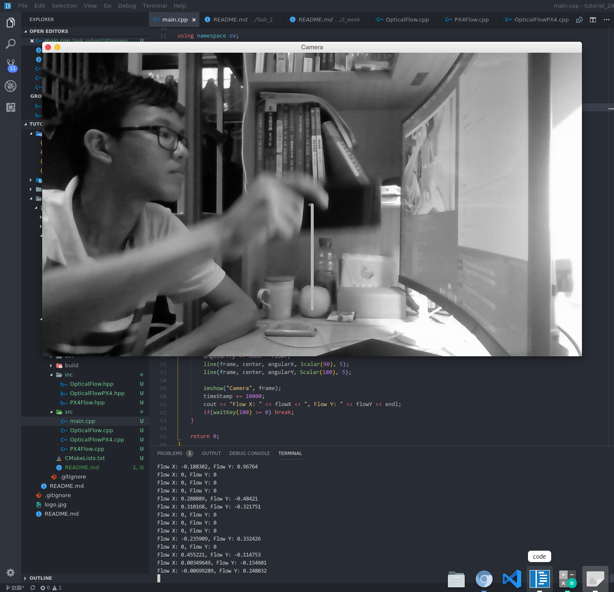

# Task 2 PX4 Optical Flow Algorithm

* Author: Atlanswer (atlanswer@gmail.com)
* Revised: Atlanswer
* Date: 2018-11-10
* Version: debug
* Abstract: PX4 optical flow algorithm demo

---

**The optical flow algorithm comes from [PX4](https://github.com/PX4/OpticalFlow).**

## Usage

### Dependencies

Their version numbers are read from test environment.

* `g++` 8.2.1
* `cmake` 3.12.3
* `make` 4.2.1
* `opencv` 3.4.3-4
* `hdf5` 1.10.3-2
* `vtk` 8.1.1-2
* `glew` 2.1.0-1

---

### Build

Using `cmake` build system, run it twice to produce `compile_commands.json` for IntelliSence, see [this issue](https://gitlab.kitware.com/cmake/cmake/issues/16588).

```shell
mkdir build
cd build
cmake ..
cmake ..
make
```

The executable shoule be in `./bin`

### Run

```shell
cd bin
./flow
```

Example

```shell
./flow
```



#### Test environment

* Arch Linux 4.18.14
* Gnome 3.30.1