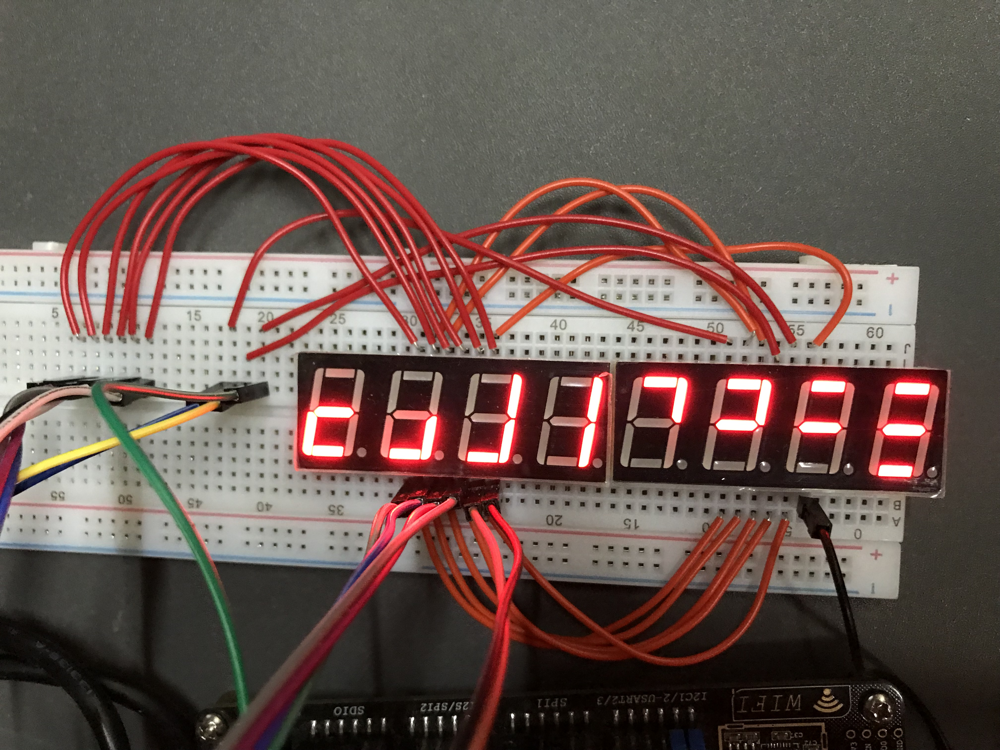
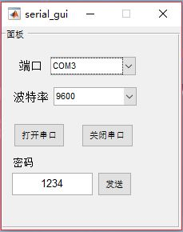
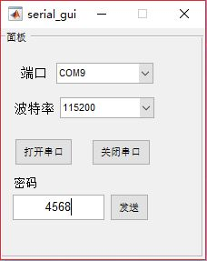
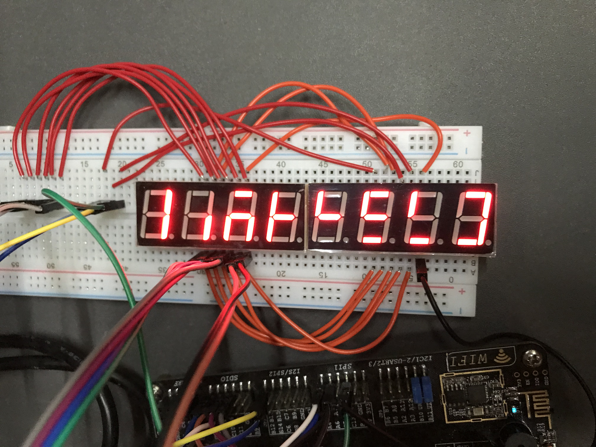
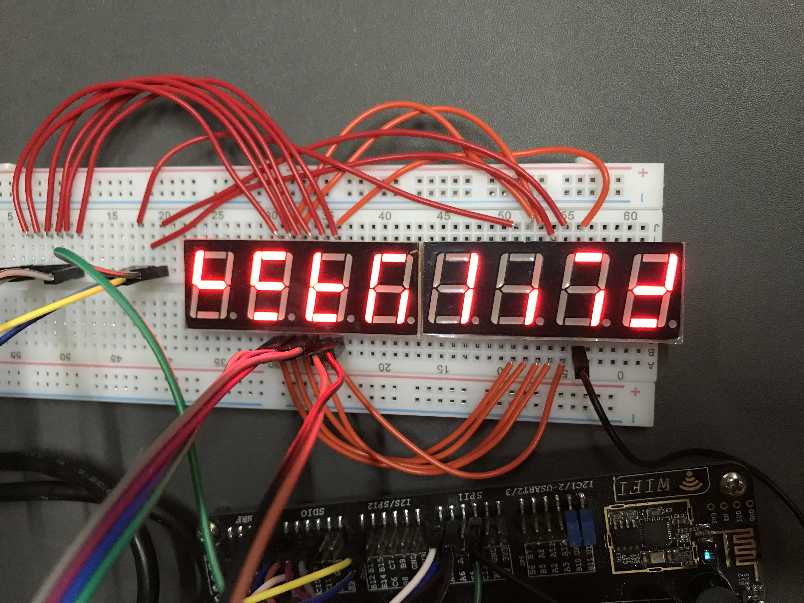

## password
- Author: Ma Feipeng
- Revised: Ma Feipeng
- Date: 2018-10-31
- Version: 1.0.0
- Abstract: this stm32 project can display the broken password, and it will change every 5s
### Function:
- Display the password which has 4 digital
- The password will be broken into two parts
- The combination mode will change every 5 seconds
- You can change the password by a matlab program
- A GUI to control the project
### Environment:
- Keil
- A stm32f103 MCU
- Two digital tubes
- Matlab 2017a
### Demo:
 - I put the **video** and the **picture** in the folder **DEMO**  
 - Please come to the file folder **DEMO** for more details  
- And the GUI program is in the folder **host_pc_GUI**  
- In order to run the gui, you should have **matlab**
#### Display the password 2333

  

#### Then I run the matlab program and input the num **4568** as the new password
 
 
  

  

#### And It will change after 5 seconds.

  

#### And there is a video show how the password change in the DEMO

