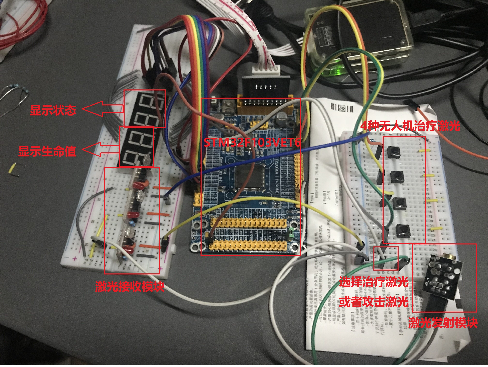

## Receving device
- Author: Ma Feipeng
- Revised: Ma Feipeng
- Date: 2018-11-7
- Version: 1.0.3
- Abstract: The laser launching and receiving module
### Function:
- Receive the laser
- Display the life and the status
- Being attacked, the num of life will decrease, and the status will be -1
- After being attacked, the num of life will not change again for 5 seconds
- Being cured, the num of life will increase by 1.
- After being cured, the num of life will not change again for 5 seconds
- The frequency of the laser can be change to 13kHz of 36kHz
- The receiving module can identify four planes
### Environment:
- Keil5
- An STM32F103VET6	
- Three laser receving modules
- A laser launch module
- A digital tube
### Demo:
And there is a **video**  in the file folder **DEMO**.
Please watch the video for more information.

