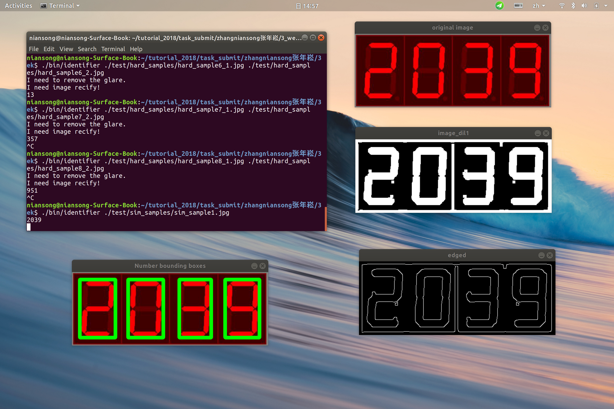
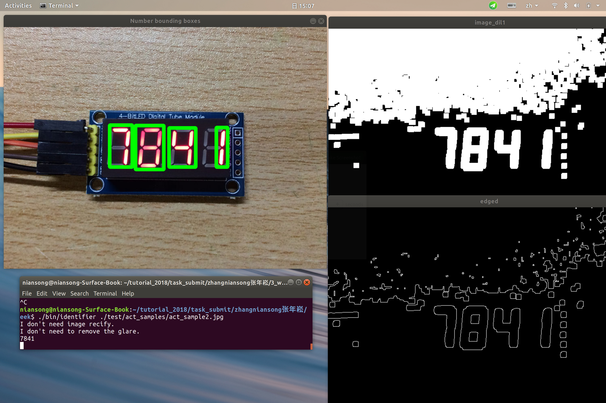
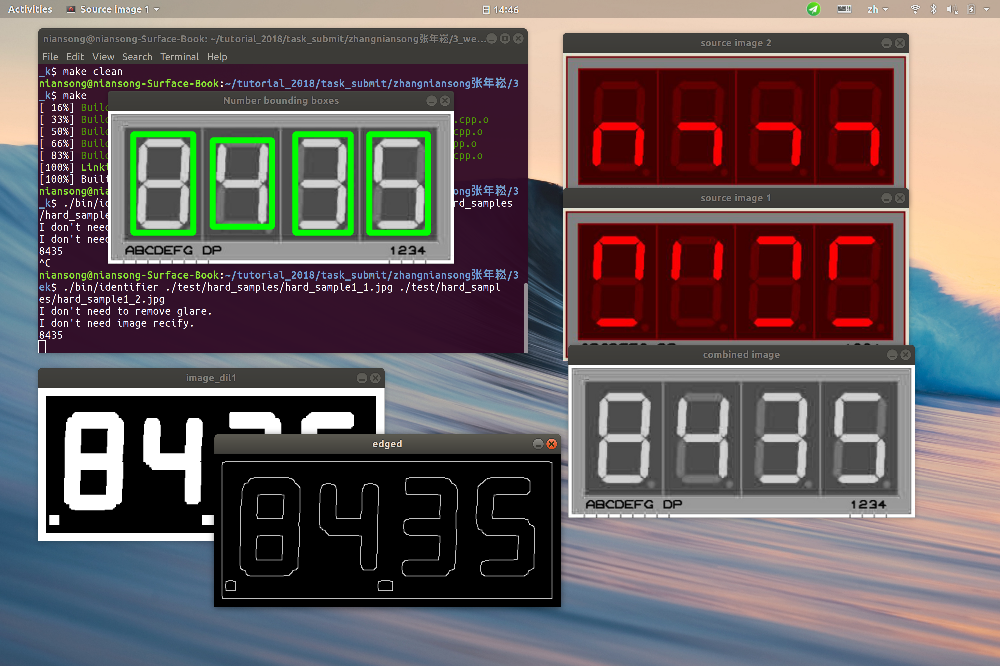

## A 7-Segment display digit identifier
- Author: Zhang Niansong
- Revised: Zhang Niansong
- Date: 2018-10-14
- Version: 1.0.0
- Abstract: A simple 7-Segment display digit identifier works in different conditions.

---

### Project structure

```
3_week
|- include/  (header file)
|- src/  (source files)
|- location/ (digit location images)
|- bin/  (executable)
|- Result/ (Result screenshots)
|- test/ (test cases)
|- train/ (training data for knn classifier)
|- README.md
|- CMakelists.txt
```

---

### Compile and Run

```
# compile
cmake .
make

# runtest

```
./bin/identifier ./test/sim_samples/sim_sample1.jpg

./bin/identifier ./test/act_samples/act_sample1.jpg

./bin/identifier ./test/hard_samples/hard_sample1_1.jpg ./test/hard_samples/hard_sample1_2.jpg

---

### Sample OUTPUT






