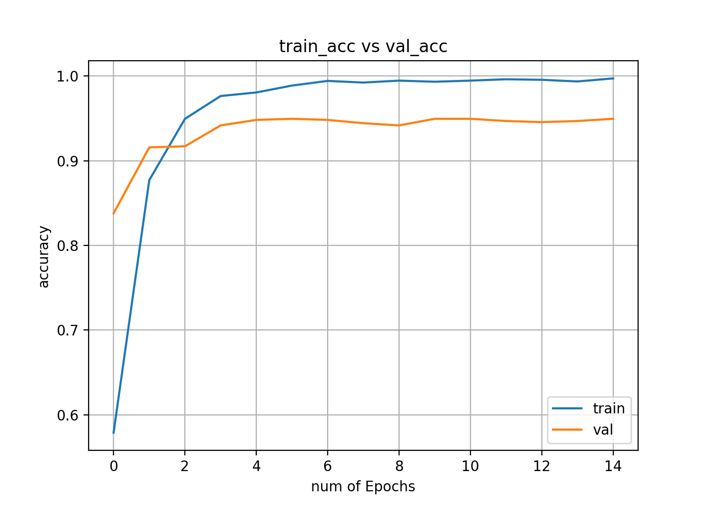

# Gesture Recognition

A gesture recogntion project using Convolutional Neural Network. This project treats recognition task as classification problem and uses a simple network architecture.

## Key Dependencies
```
- python 3.6.2 (or other versions)
- tensorflow
- keras
- opencv 3.4.2
```

## Usage
First enter this working directory, then:
```
python trackgesture.py
```
Then, you can either:
```
What would you like to do ?
    1- Use pretrained model for gesture recognition
    2- Train the model (you will require image samples for training under .\imgfolder_b)
    3- Exit	
```
Weight file: (Too large that exceeds GitHub limit)
```
链接：https://pan.baidu.com/s/1rvjs80GiOv59s_NP1LqV_g 提取码：N34K
```
Please Download this and put in the same folder with trackgesture.py

### Make new dataset
In prediction mode, you can also make your own data set:
```
Options:
 Press n - enter a name of a new gesture folder
 Press s - to start/pause capturing new gestures
```
First press 'n' to create a new folder to contain new gesture images. Then, press 's' to start capturing images. The new images will be stored in the folder you just created, and will be named in 'foldername' + 'number'.

### Recognize Gestures
Once you are in prediction mode, you will see options on screen:
```
b - Toggle binary/skin mask
g - Toggle prediction mode
```
Press 'g' to start gesture recognition.
Press 'b' to change background mask.

To Move ROI:
```
j - left
l - right
k - down
i - up
```

Please note that skin mask is better for noisy background.


## Demo
This demo is running on Intel i5 CPU with no GPU acceleration, for about 25 frames per second.

Please note that different lighting conditions and background will affect the prediction result.
## Training

I trained this little network on local machine (Intel i5, no GPU acceleration) and it took about 15min/epoch. 

### Architecture Summary
```
_________________________________________________________________
Layer (type)                 Output Shape              Param #   
=================================================================
conv2d_1 (Conv2D)            (None, 32, 198, 198)      320       
_________________________________________________________________
activation_1 (Activation)    (None, 32, 198, 198)      0         
_________________________________________________________________
conv2d_2 (Conv2D)            (None, 32, 196, 196)      9248      
_________________________________________________________________
activation_2 (Activation)    (None, 32, 196, 196)      0         
_________________________________________________________________
max_pooling2d_1 (MaxPooling2 (None, 32, 98, 98)        0         
_________________________________________________________________
dropout_1 (Dropout)          (None, 32, 98, 98)        0         
_________________________________________________________________
flatten_1 (Flatten)          (None, 307328)            0         
_________________________________________________________________
dense_1 (Dense)              (None, 128)               39338112  
_________________________________________________________________
activation_3 (Activation)    (None, 128)               0         
_________________________________________________________________
dropout_2 (Dropout)          (None, 128)               0         
_________________________________________________________________
dense_2 (Dense)              (None, 6)                 774       
_________________________________________________________________
activation_4 (Activation)    (None, 6)                 0         
=================================================================
Total params: 39,348,454
```

 

### Loss and Accuracy



### Console Output
```
Epoch 1/15
  96/3083 [..............................] - ETA: 16:20 - loss: 6.9792 - acc: 0.2083
 288/3083 [=>............................] - ETA: 13:28 - loss: 5.1381 - acc: 0.1979
3083/3083 [==============================] - 903s 293ms/step - loss: 1.4231 - acc: 0.5790 - val_loss: 0.4855 - val_acc: 0.8379
Epoch 2/15
 224/3083 [=>............................] - ETA: 12:42 - loss: 0.4000 - acc: 0.8705
3083/3083 [==============================] - 903s 293ms/step - loss: 0.3711 - acc: 0.8771 - val_loss: 0.2599 - val_acc: 0.9157
Epoch 3/15
  96/3083 [..............................] - ETA: 12:58 - loss: 0.1629 - acc: 0.9583
 704/3083 [=====>........................] - ETA: 10:22 - loss: 0.1420 - acc: 0.9588
1856/3083 [=================>............] - ETA: 5:16 - loss: 0.1569 - acc: 0.9531 
3083/3083 [==============================] - 916s 297ms/step - loss: 0.1669 - acc: 0.9494 - val_loss: 0.2360 - val_acc: 0.9170
Epoch 4/15
 576/3083 [====>.........................] - ETA: 11:38 - loss: 0.1020 - acc: 0.9688
2752/3083 [=========================>....] - ETA: 1:33 - loss: 0.0776 - acc: 0.9749 
3072/3083 [============================>.] - ETA: 3s - loss: 0.0747 - acc: 0.9762  
3083/3083 [==============================] - 974s 316ms/step - loss: 0.0747 - acc: 0.9763 - val_loss: 0.1775 - val_acc: 0.9416
Epoch 5/15
3083/3083 [==============================] - 936s 303ms/step - loss: 0.0592 - acc: 0.9805 - val_loss: 0.1687 - val_acc: 0.9481
Epoch 6/15
2464/3083 [======================>.......] - ETA: 2:40 - loss: 0.0334 - acc: 0.9878    
3083/3083 [==============================] - 909s 295ms/step - loss: 0.0346 - acc: 0.9886 - val_loss: 0.2040 - val_acc: 0.9494
Epoch 7/15
3083/3083 [==============================] - 901s 292ms/step - loss: 0.0208 - acc: 0.9942 - val_loss: 0.2109 - val_acc: 0.9481
Epoch 8/15
3083/3083 [==============================] - 910s 295ms/step - loss: 0.0249 - acc: 0.9922 - val_loss: 0.2119 - val_acc: 0.9442
Epoch 9/15
3072/3083 [============================>.] - ETA: 2s - loss: 0.0185 - acc: 0.9945   
3083/3083 [==============================] - 920s 298ms/step - loss: 0.0184 - acc: 0.9945 - val_loss: 0.2272 - val_acc: 0.9416
Epoch 10/15
3083/3083 [==============================] - 913s 296ms/step - loss: 0.0206 - acc: 0.9932 - val_loss: 0.2313 - val_acc: 0.9494
Epoch 11/15
3083/3083 [==============================] - 912s 296ms/step - loss: 0.0205 - acc: 0.9945 - val_loss: 0.2160 - val_acc: 0.9494
Epoch 12/15
3083/3083 [==============================] - 906s 294ms/step - loss: 0.0105 - acc: 0.9961 - val_loss: 0.2403 - val_acc: 0.9468
Epoch 13/15
3083/3083 [==============================] - 913s 296ms/step - loss: 0.0127 - acc: 0.9955 - val_loss: 0.2351 - val_acc: 0.9455
Epoch 14/15
3083/3083 [==============================] - 903s 293ms/step - loss: 0.0140 - acc: 0.9935 - val_loss: 0.2547 - val_acc: 0.9468
Epoch 15/15
3083/3083 [==============================] - 922s 299ms/step - loss: 0.0077 - acc: 0.9971 - val_loss: 0.2561 - val_acc: 0.9494
```

## 关于比赛中使用手势识别的想法

此项目将手势识别作为分类问题来处理，这是因为事先划定了检测范围而简化了问题。实际中使用需要同时检测手的位置，所以位置的检测应该当作一个回归问题来处理。实际中使用需要考虑这样几个问题：
1. 背景对识别的影响
2. 同一手势的不同姿态对识别的影响
3. 网络在嵌入式系统上运行的效率和速度

另一个想法是如果有深度的信息，或许可以做出一个较为精确的人手三维模型检测，如下面这个项目：
https://github.com/FORTH-ModelBasedTracker/HandTracker
但是这个项目需要的内存和计算量都很大，可能不适合在嵌入式系统上运行。但是利用深度信息进行手势检测可能是一个值得考虑的方向。