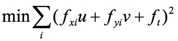

# Optical FLow

* Author: Zhang Niansong
* Date: 2018-11-09
* Version: 1.0.0
* Abstract: An implementation of Lucas-Kanade's method of computing optical flow.

## Lucas-Kanade Optical Flow Method
Optical Flow is used in object-tracking, camera correction, mosaics and so on.

All Optical Flow methods are based on the following assumptions:
* Color constancy;
* Small motion between consecutive frames

With these assumptions, if we have two adjacent frames of a video, we have:

Assuming color constancy:


Assuming small motion:


Then we can get the Constraint Equation of Optical Flow:


If we divide each side by `dt`


The Lucas-Kanade's method is just to use small window and least square method:



Taking derivatives:


Writing equation into matrix format:


It finds the `u`, `v` that satisfy constrain by taking derivative of the least squre equation, and solve the derivative equations to get `u` and `v`.


## Project Structure
```
optical
|- bin/ (binary executable)
|- img/ (output screenshot)
|- src/ (source code)
|- CMakeLists.txt
|- Readme.md
```

## Dependency
```
- OpenCV 3.4.2 (and its dependencies)
- Program requires a camera input
```

## Compile and Run
```
# compile
cmake .
make

# run
./bin/optical
```

## Output
The program tries to draw optical flow vectors on screen and print optical flow value in console between two consecutive frames.


