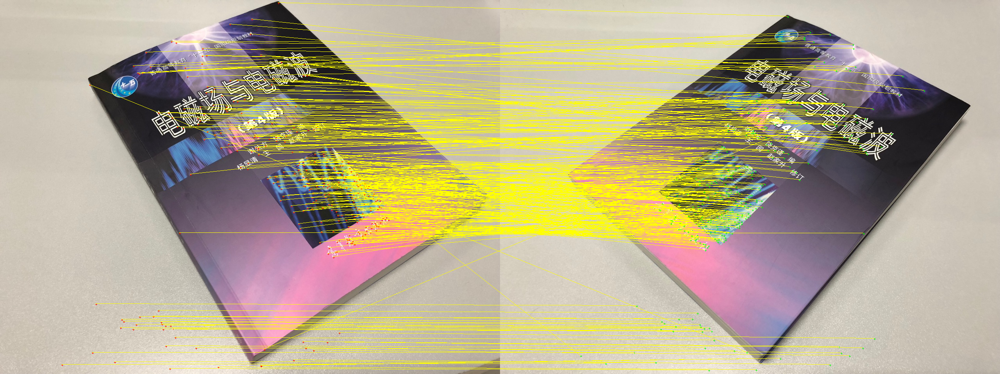

# Scale-Invariant Feature Transform

* Author: Zhang Niansong
* Date: 2018-11-09
* Version: 1.0.0
* Abstract: A SIFT implementation that is independent on OpenCV

## Project Structure
```
sift
|- bin/ (binary executable file)
|- img/ (test images)
|- include/ (header files)
|- src/ (source files)
|- README.md
|- CMakeLists.txt
```

## Dependency
```
Library: CImg.h (already included in project)
```


## Compile and Run
```
# compile
cmake .
make

# run
./bin/sift ./img/0.jpg ./img/1.jpg
```

# Project Description

Matching Feature Point:

This project uses Brute-Force method to match sift feature points. Given two images, it firstly detects the feature points of both images. Then, for each point in the first image, it computes the Euclidean distance between the point and every point on the other image. After that, it returns the two points with smallest distance.

Assume point1 has the least distance `d1`, point2 has second lease distance `d2`, a ratio is calculated:
```
ratio = d1/d2
```
if `ratio` > 0.7, the program consider the pair as a match.


# Output



